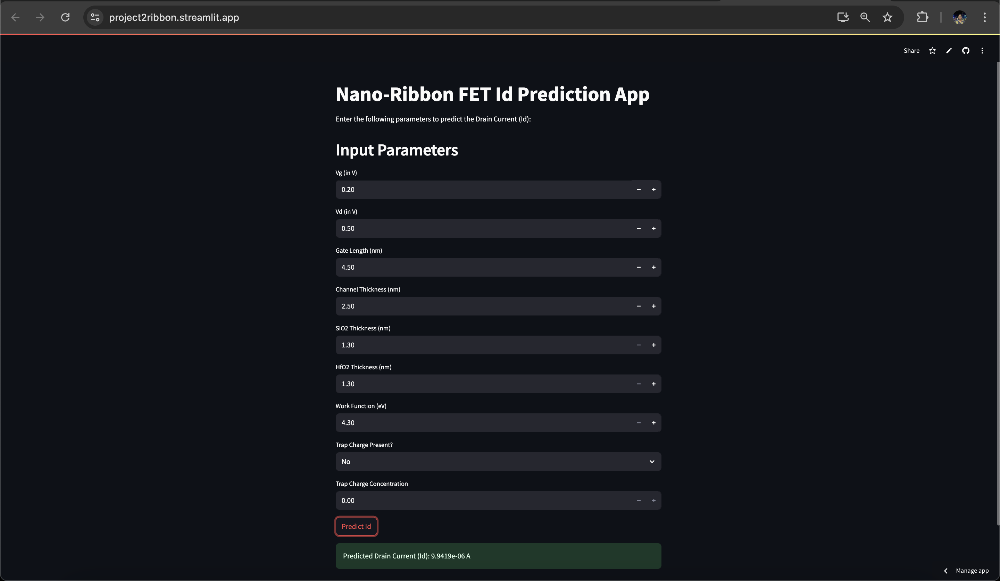

# Nano-Ribbon FET Id Prediction App

## 📌 Overview
This application predicts the **Drain Current (Id)** of a **Nano-Ribbon Field-Effect Transistor (FET)** based on user-provided input parameters. It was developed as part of a final-year engineering project at **[Your College Name]** with the goal of modeling and simulating electrical characteristics of nano-scale transistors.

---

## 🔧 Features
- Predicts Drain Current (`Id`) using:
  - Gate Voltage (`Vg`)
  - Drain Voltage (`Vd`)
  - Gate Length (nm)
  - Channel Thickness (nm)
  - SiO₂ Thickness (nm)
  - HfO₂ Thickness (nm)
  - Work Function (eV)
  - Trap Charge Present? (Yes/No)
  - Trap Charge Concentration (cm⁻²)

- **User-Friendly Interface**: Built with HTML, CSS, and JavaScript for ease of use.
- **Responsive Design**: Works well on both desktop and mobile devices.

---

## 🖼️ Screenshots
  
*Example of the app interface showing input fields and the prediction result.*

---

## 💻 Technologies Used
- **Backend**: Streamlit
- **Model**: XGBoost Machine Learning for predicting `Id`
- **Dataset**: Custom dataset built by simulating 300+ nano-devices in Synopsis TCAD.

---
## 🧪 How to Use
1. Enter Input Parameters :
  - Fill in all the required fields accurately:
  - Gate Voltage (Vg)
  - Drain Voltage (Vd)
  - Gate Length (nm)
  - Channel Thickness (nm)
  - SiO₂ Thickness (nm)
  - HfO₂ Thickness (nm)
  - Work Function (eV)
  - Trap Charge (Yes/No)
  - Trap Charge Concentration (cm⁻²)
2. Predict Id :
  - Click the "Predict Id" button. The predicted Drain Current will be displayed below.

---
## Access the App
- Open your browser and go to: [Nano-Ribbon FET Id Prediction App](https://project2ribbon.streamlit.app/)

---

## 📬 Contact
For questions, feedback, or collaboration opportunities, feel free to reach out:

- GitHub : https://github.com/siddha-forever
- Email : mohapatra.siddhabrata@gmail.com
- LinkedIn : [https://www.linkedin.com/in/siddhabrata-mohapatra](https://www.linkedin.com/in/siddhabrata-mohapatra)

---

## 🙏 Acknowledgments
- Dataset source: Custom build
- Mentor - Faculty: Dr. Biswajit Jena
